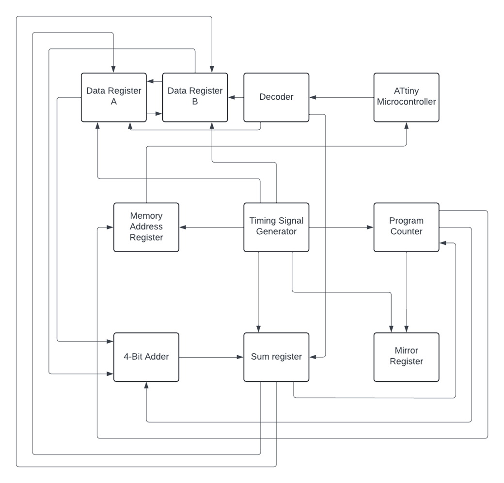
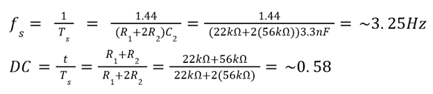
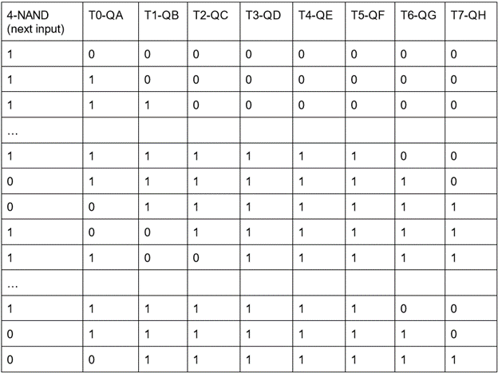
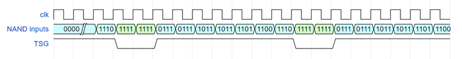
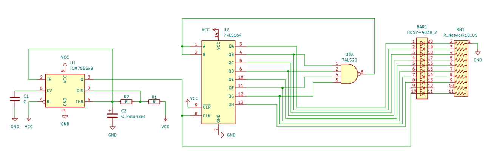
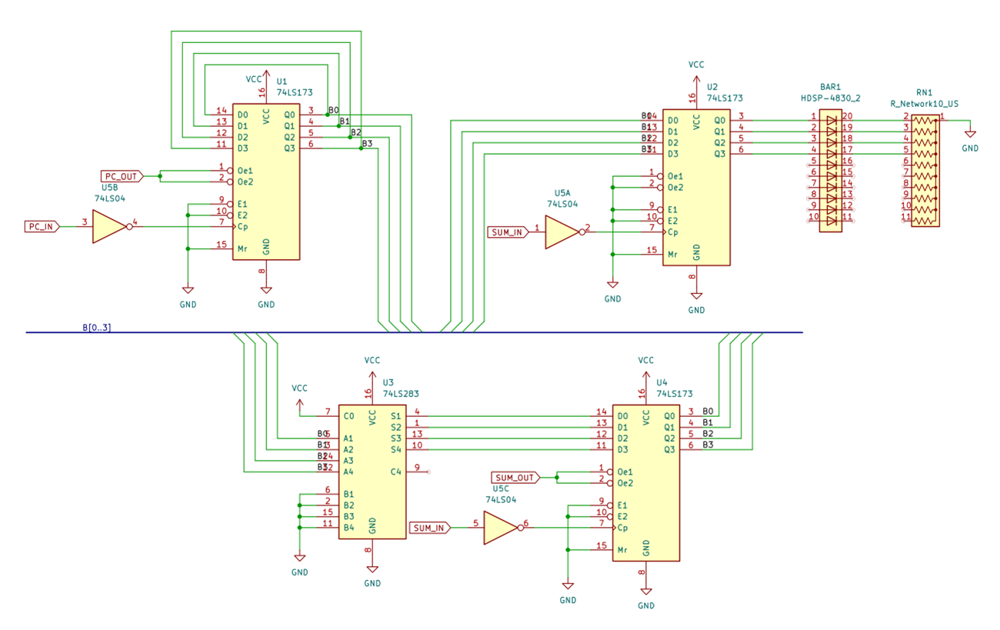

# 4-Bit-Processor
A 4-Bit Processor built in my system hardware university laboratory

## Index
#### [Introduction](#introduction-1)
#### [Integrated circuits components descriptions](#integrated-circuits-components-descriptions-1)
- [555](#555-timer) 
- [74LS164](#74ls164-sipo-shift-register) 
- [7420](#7420-nand-gate) 
- [74LS283](#74ls283-4-bit-adder) 
- [74LS173](#74ls173-4-bit-register) 
- [ATtiny2313A](#attiny2313a) 
- [7442](#7442-decoder) 
- [7404](#7404-not-----gate) 
- [7408](#7408-and----gate) 
- [7432](#7432-or----gate) 
#### Computer specific workings and wiring
- [Timing signal generator](#Timing-Signal-Generator)
- [Data bus](#Data-Bus)
- [Program counter](#Program-Counter)
- [Arithmetic unit](#Arithmetic-Unit)
- [Mirror register]
- [Memory]
- [Data registers]
- [Control signal generator]

## Introduction
This lab report describes the process of building a 4-bit computer using different integrated circuits such as registers, logic gates, a clock, and more. The different components that make up this computer include a timing signal generator (TSG), a program counter (PC), an arithmetic logic unit (“ALU”), a sum register, data registers, memory address register (MAR), program memory, a decoder, a control signal generator (CSG), and a bus. 

Once constructed, the computer will be able to execute a simple program of sixteen instructions, varying between five different opcodes. The executable commands are to 
Increment register A
Increment register B
Move the contents of register A to register B
Move the contents of register B to register A
No operation
and are executed in the order saved in a preprogrammed ATtiny2313A microcontroller acting as the computer’s memory.

The following sections of the lab report cover everything there is to know about the construction and functioning of the computer in more detail, from schematics to timing diagrams.

Shown in the following figure is a picture of the finished computer:
  
Click here for a [video](https://youtube.com/shorts/8P3Bk8ZhHko?si=GYPgo7M3aASAGeQ_) of the functionning computer.

## Integrated circuits components descriptions
This section will introduce every integrated circuit used in this lab. Specific wiring between ICs will be discussed in later sections, differences in wiring and functionality for the same IC will also be discussed in other sections, this is only an overview and an explanation for important pins.

NOTE: Please refer to any official documentation for the pin-out diagram of each component  

Below is every component in the computer and the integrated circuits they are composed of

#### Timing signal generator (TSG)
555 Timer - clock 
74LS164 SIPO shift register - timing signal generator 
7420 NAND gate - input for the timing signal generator
#### Arithmetic unit (“ALU”) and program counter (PC)
74LS283 4-bit adder - pseudo ALU (can only add) 
74LS173 4-bit register - program counter 
74LS173 4-bit register - sum register 
74LS173 4-bit register - mirror register 
7404 NOT gate - invert clock signals
#### Data registers and memory address register (MAR)
74LS173 4-bit register - data register A 
74LS173 4-bit register - data register B 
74LS173 4-bit register - memory address register
#### Program memory (ROM)
ATtiny2313A - read-only memory block 
7442 decoder
#### Control signal generator
7408 AND gate 
7432 OR gate

### Integrated Circuis

In general, pins with label VCC should be connected to VCC, and GND linked to ground.
In this lab, LEDs are used to see the outputs. To connect an LED, link the output on the side with words (anode), then on the blank side (cathode) link a grounded bussed resistor pack.
 
#### 555 Timer
This IC is used as the clock of the computer.
Pin 4 is a reset pin, it gets triggered when the input is a “logic 0”. Therefore, it must be wired to VCC/logic 1 to prevent it from constantly resetting
Pin 3 is the clock output
Two resistor and two capacitors are also needed to wire this IC functionally

#### 74LS164 SIPO shift register
This IC creates a timing signal since it shifts its content by one output every clock cycle. Input signals are obtained from the NAND gate.
Pin 9 clears the register, it triggers when getting logic 0 so wire it to VCC to prevent that
Pin 1 & 2 are the input pins, it is a AND logic gate and should be tied together
Pin 3-6 and 10-13 are the output pins, with QA as T0, QH is T7, and all the in-betweens

#### 7420 NAND gate
This NAND gate takes 4 inputs, ANDs them and inverts the result. It takes 4 inputs from the 74LS164 and returns 74LS164’s inputs
Pin 3 and pin 11 have no particular function
The inputs from the 74LS164 should be taken from pins 4(QB), 6(QD), 11(QF), 12(QG)

#### 74LS283 4-bit adder
This component is used to increment the number inputted from the bus
Pins 5(X0), 3(X1), 14(X2), 12(X3) should be linked to the bus to get the input
Pins 6, 2, 15, 11 (Y0 to Y3) should be grounded for the second input to be 0
Pin 7 (carry in) should be wired to VCC to obtain the +1 increment
Pins 4, 1, 13, 10 (SUM0 to SUM3) will be linked to the sum register (and not directly onto the bus to prevent bus conflict)
The order of the bits matter

#### 74LS173 4-bit register 
This component can save 4 bits of data input and output it when needed
Pin 15 clears the register, it triggers on active high (logic 1) so ground it to prevent that
Pin 7 is the clock, this clock is positive edge triggered (when clock goes from 0 to 1). However, the computer being built is negative edge triggered, so clock inputs have to be inverted in order for these components to follow the timing
Pin 9 and 10 are the write-enable inputs. They are always grounded (logic 0) so that the register can save new data
Pin 1 and 2 are the output-enable pins, the register can only output when they both have logic 0, so they must be tied together

#### ATtiny2313A
This component has 16 instructions precoded and serves as the memory of the computer. The memory cannot be reprogrammed, meaning its a ROM (read-only memory)
Pin 1 is the reset pin and must be linked to VCC with a 47kΩ resistor
Pin 2, 3, 6, 7 (PD0 to PD3) are the address pins, the inputs are obtained from the MAR
Pin 12, 13, 14, 15 (PB0 to PB3) are the output pins of information encoded at the address

#### 7442 decoder
This component translate binary numbers into active low decimal output
Pin 15, 14, 13, 12 (I0 to I3) are the input pins, from the ATtiny2313A
Pin 1, 2, 3, 4, 5, 6, 7, 9, 10, 11 (Y0 to Y9) are the output pins, although for the purposes of the lab only the first 5 are needed

#### 7404 NOT ( - ) gate
Contains 6 sets of inverting logic gates, one input for one output

#### 7408 AND ( & ) gate
Contains 4 sets of AND logic gates, two inputs for one output

#### 7432 OR ( || ) gate
Contains 4 sets of OR logic gates, two inputs for one output

Shown in the following figure is a picture showing what each integrated circuit is in the computer:

## Computer Specific Workings and Wiring

This section is mostly about how each part of the computer works and communicates between each component, along with more wiring connections.

The following figure is a diagram of every component in the computer which will help in understanding the processors functionning:

### Timing Signal Generator
Timing Signal Generator
The timing signal generator is the first important component of the computer which dictates when every piece of hardware can communicate with each other, making the computer's components work in perfect synchronization. It uses a 555 timing circuit to generate a pulsating clock with a frequency of around 3.25Hz, meaning that it completes a cycle of going from a logical zero, or low voltage, to a high voltage logical one and back to low voltage 3.25 times per second. Moreover, the ratio representing the amount of time for which the logical 1 is held - compared to the logical zero during a clock cycle - is known as the duty cycle.

The 555 clock is wired with 22kΩ (R1) and 56kΩ (R2) resistors, as well as 3.3nF (C2) and 10nF (C1) capacitors, allowing the frequency and duty cycle to be calculated using the below formulas.

These calculations reveal that the frequency of the 555 timing circuit is 3.25Hz and that the duty cycle is of 58%, meaning that the “logical one” is held for 58 percent of the whole duration of the clock cycle.

This clock cycle is then fed into pin 8 of a 74LS164 shift register, as seen in figure 1, which shifts all values within its eight internal flip flops when a positive edge is detected in the clock signal. This means that when the clock signal goes from zero to a one, the value from the first flip flop is shifted into the second, and so on. The value shifted in the first flip flop is determined by the ANDing the shift register’s A and B pins, which in this computer’s case are connected to the output of a four input 7420 NAND gate whose inputs are the values of the second, fourth, sixth and seventh flip flop of the shift register, or pins QB, QD, QF, and QG. This has the effect of creating a feedback which will shift two consecutive zeros into the shift register filled with ones, making zeros “float” within a “sea of ones”. Connecting the shift register’s outputs to an LED pack helps visualize this phenomenon consisting of two turned off leds being moved to the end of the LED pack, returning at the other end once they disappear, as seen in table & diagram 1.

The following table shows the inputs and outputs of the timing signal generator:

The outputs of the 74LS164’s QA to QH pins will be named signals T0 to T7, with: 
- T0 being known as signal PC_OUT
- T1 as SUM_IN
- T2 as SUM_OUT
- T3 as PC_IN
referring to their use in controlling the computer’s different components, which will be explored in greater detail in further sections of this lab report.
The schematic found in figure 1 shows the necessary connections to construct the TSG and completes this component’s section.

The following figure shows the wiring of the Timing Signal Generator:

### Data Bus
The data bus is the connection of every component to every other component that needs to communicate to each other. It can be seen as a highway of information between components, where each component will send its data accordingly and others receive it with the help of timing signals given by the TSG. The bus used in this computer is known as a four bit bus because it is composed of four wires, each contributing to transporting one bit of information. 

The advantage of using a bus is that it eliminates the need to connect every component to every other component it may need to send data to, as doing so would result in a great mess of wires. However, in this configuration, it is of course very important to make sure that no two components send their information on the bus at the same time, as that would create a bus conflict because of the possible short-circuiting of integrated circuits via the chaos in the voltages representing the bus’ data. In the case of this four bit computer, when the output of an integrated circuit is being controlled by the timing signal generator to stop the sending of data onto the bus, the buffer connecting the circuit to the bus is in the high-impedance state, meaning that it is impossible for electricity to flow in either direction through the device. Otherwise, the states of the devices are known as high output state and low output state, referring to logic zeros and logic ones. This allows the different components that will later need to be connected to the bus to take turns communicating on the bus without interference from other devices in the high-impedance state. 

### Program Counter
The program counter is the next necessary part in the construction of the four bit computer as it keeps count of which instruction is to be executed. It consists of a 74LS173 register with timing signal T3, or PC_IN, as its clock and T0 or PC_out connected to the tri state buffer. It must be noted that the 74LS173 register requires a negated clock signal, so the T3 signal is passed through a NOT gate, and the same applies for all other 74LS173s that will be used in the making of this computer. The input and output pins of the program counter register will all be connected to the tri state bus as the timing signal clock will allow it to get data from the bus as well as output onto it whenever it needs, and the tri-state buffer disconnects it’s output when it is not necessary for it to have it’s output enabled. Pins 9 and 10 of the program counter register can then be connected to ground as their signal is inverted and the register should always be enabled considering the TSG clock is already controlling the register, and the same will hold true for every 74LS173 register that will be used in this computer.

The program counter by itself serves little purpose as it needs to be combined with an arithmetic unit in order to be incremented and function as a counter would, because as was mentioned before, the program counter keeps count of which instruction is to be executed. This means that the value held in the program counter will always increment by one, reaching fifteen, before going back to zero in order to restart the count. The value of fifteen is not an arbitrary number, but is because the computer has four bits, and 24 is 16, meaning that starting at 0 going to 15 gives 16 possible values.

### Arithmetic Unit
The arithmetic unit is a component that has many uses in a computer as it can perform arithmetic operations on values fed to it. In this computer's case, the values on which the unit performs operations are given to it via the input pins connected to the bus. Additionally, its carry-in pin C0 is wired directly to VCC, giving it a constant logical one as its sole purpose is to increment values that can either be the PC value or values held in the data registers A and B, which will be touched on later. 

This 4-bit adder has its carry in constantly set to one, as was previously mentioned, meaning that any value X currently on the bus will always be output as X+1 by the adder. The unit is combined with a register called the sum register, which when enabled by a clock, will take in the value output by the arithmetic unit as its input pins are connected directly to the adder's outputs, as can be seen in figure 3. The way the combination of 4-bit adder and sum register work in incrementing PC value is that the arithmetic unit does not need to be enabled by any sort of clock, meaning that when the current value of the program counter is sent on the bus on the PC_OUT signal, the SUM_IN signal will enable the sum register to get the 4-bit adder result as its input.

A similar process will be used to perform the IncA and IncB operations which will later need to be implemented, except that the clock pin of the sum register will no longer be connected solely to the SUM_IN timing signal, as a different timing signal called the control signal will need to be implemented to properly increment other values sent on the bus. However, these modifications will be explained in further detail in the part of the lab report where the control signal generator is discussed.

The timing diagram for timing signals T0 to T3 can be seen in the following figure:

Lastly, the signals that are used by the program counter and sum register can be seen in figure 2, where the signal T1 and T3 are reversed as the computer is negative edge to be triggered, hence why timing signals are sent through NOT gates before being connected to their clock pins labeled Cp, as seen in figure 3.

